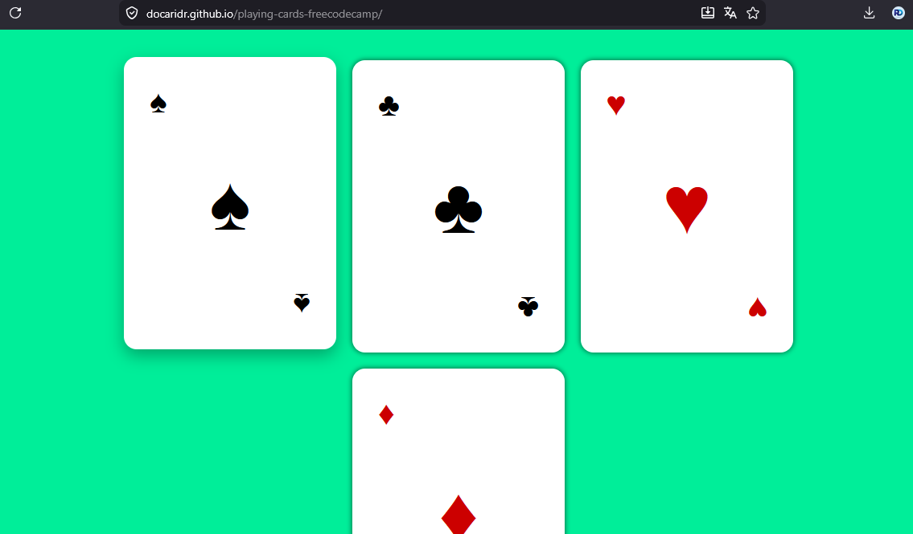

# Playing Cards

Exercice CSS Flexbox consistant à reproduire un jeu de cartes à jouer avec les quatre enseignes, en structurant chaque carte via des conteneurs flex imbriqués.

---

---

## 🛠 Technologies

---

## Aperçu

---

## Ce que j'ai appris

Ce projet m'a permis de mettre en pratique deux leçons clés du cours freeCodeCamp :

**`justify-content` et `align-self` pour positionner des éléments indépendamment**
En appliquant `flex-direction: column` sur chaque carte, j'ai pu utiliser `justify-content: space-between` pour répartir les trois symboles (haut, centre, bas), et `align-self` pour les aligner à gauche, au centre ou à droite selon leur position. C'est la combinaison des deux propriétés qui donne l'illusion d'une vraie carte à jouer.

**`flex-wrap` pour un affichage multi-colonnes réactif**
Le conteneur `#playing-cards` utilise `flex-wrap: wrap` et `justify-content: center`, ce qui permet aux cartes de passer automatiquement à la ligne sur les petits écrans — sans media query.

**`aria-label` et `aria-hidden` pour l'accessibilité des symboles Unicode**
Les symboles ♠ ♣ ♥ ♦ ne sont pas correctement interprétés par tous les lecteurs d'écran. J'ai ajouté `aria-label` sur chaque carte et `aria-hidden="true"` sur les symboles pour garantir une expérience accessible.

---

## Démo en ligne

-> [Voir le projet](https://docaridr.github.io/playing-cards-freecodecamp)

---

## Auteur

Réalisé par [DocariDR](https://github.com/DocariDR) — dans le cadre du certificat *Responsive Web Design* de freeCodeCamp.
